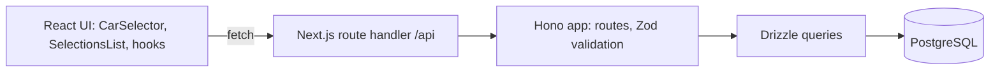

# car-selector-app

A small full-stack app to pick a car brand, model and year, save the selection, and list or delete saved selections.


## The problem

A selection form has dependent fields: the models on offer depend on the brand, and a saved choice must not pair a model with the wrong brand or exist twice. Enforcing this only in the browser is not enough, because any HTTP client can call the API directly.

## The approach

One Next.js project (App Router) serves the UI and the API. The API is a Hono app mounted in a catch-all route handler, so there is a single process and a single deployment. Requests are validated with Zod, data access goes through Drizzle on PostgreSQL, and the server re-checks that the model belongs to the brand and that the selection does not already exist before inserting. The trade-off is that the API and the UI share one deployable unit.

## Engineering highlights

- **Hono inside a Next.js route handler.** The whole API sits behind one catch-all route. See [`src/app/api/[[...route]]/route.ts`](src/app/api/[[...route]]/route.ts) and [`src/lib/api/app.ts`](src/lib/api/app.ts).
- **Validation at the edge.** Query, params and body are validated with Zod through `@hono/zod-validator`. See [`src/lib/api/schemas.ts`](src/lib/api/schemas.ts) and [`src/lib/api/routes/selections.ts`](src/lib/api/routes/selections.ts).
- **Integrity in the schema.** Foreign keys with cascade, a unique model name per brand, a unique `(brand, model, year)`, and indexes on the lookup columns. See [`src/lib/db/schema.ts`](src/lib/db/schema.ts).
- **Server-side consistency check.** Creating a selection verifies that the model belongs to the brand (`validateModelBrand`) and rejects duplicates. See [`src/lib/db/queries/selections.ts`](src/lib/db/queries/selections.ts) and [`src/lib/db/queries/models.ts`](src/lib/db/queries/models.ts).
- **Bounded pagination.** Page size defaults to 10 and is capped at 100, and the count runs in parallel with the page query. See [`src/lib/utils.ts`](src/lib/utils.ts) and `getAllSelections` in [`src/lib/db/queries/selections.ts`](src/lib/db/queries/selections.ts).
- **Typed application errors.** An `AppError` carries a status and a code. See [`src/lib/api/errors.ts`](src/lib/api/errors.ts). The HTTP status handling has a known issue, see below.

## Architecture



## API

| Method | Path | Purpose |
| --- | --- | --- |
| GET | `/api/health` | Health check |
| GET | `/api/brands` | List brands |
| GET | `/api/models?brandId=` | List the models of a brand |
| GET | `/api/selections?page=&limit=&brandId=&modelId=&year=` | Paginated selections. The filters apply only when both `brandId` and `modelId` are given, `year` then narrows further |
| POST | `/api/selections` | Create a selection from `brandId`, `modelId` and an optional `year` |
| DELETE | `/api/selections/:id` | Delete a selection |

## Tech stack

From [`package.json`](package.json) and [`docker-compose.yml`](docker-compose.yml):

- Next.js 16.1.0, React 19.2.3, TypeScript 5
- Hono 4 with `@hono/zod-validator`, Zod 4
- Drizzle ORM 0.45 and Drizzle Kit, `postgres` driver
- PostgreSQL (image `supabase/postgres:15.1.0.73` in Compose)
- Tailwind CSS 4, Radix UI Select
- ESLint 9, Jest 30 (configured, no tests)

## Getting started

```bash
git clone https://github.com/guillaume-lecomte/car-selector-app
cd car-selector-app
npm ci
cp .local.env .env
docker compose up -d
npm run db:push
npm run db:seed
npm run dev
```

The app is then on `http://localhost:3000`. `npm run db:push` asks for a confirmation before applying the schema; add `-- --force` to skip it (`npm run db:push -- --force`).

Verified on 2026-10-06 with Node.js 22 and npm 10, using a locally installed PostgreSQL 16 on port 5432 with the database `car_selector`, instead of Docker: `npm ci`, `npm run typecheck`, `npm run lint`, `npm run db:push -- --force` and `npm run db:seed` succeed (2 brands and 8 models are inserted), and the API answers on `/api/health`, `/api/brands` and `/api/selections`. The `docker compose up -d` step itself was not run.

## Status

Example project, not maintained. Last significant activity 2025-12-20.

## Known issues

- **No tests.** `npm test` exits with an error because no test file exists, although [`jest.config.js`](jest.config.js) sets coverage thresholds and [`src/__tests__/setup.ts`](src/__tests__/setup.ts) is in place. That setup file requires `DATABASE_URL` to contain `test` and empties the tables between tests.
- **Business errors are returned with HTTP 200.** `handleError` returns `AppError` responses without a status ([`src/lib/api/errors.ts`](src/lib/api/errors.ts), line 30). Checked on 2026-10-06 against the running app: creating a duplicate, deleting an unknown id and sending a model that does not belong to the brand each answer `200` with `"success": false`. The UI relies on that flag. Validation errors answer `400` with a different body shape.
- **Duplicates with no year are only checked in application code.** PostgreSQL treats `NULL` values as distinct in a unique constraint, so `(brand, model, NULL)` is not protected by the database, and the check before the insert is not atomic.
- **The UI shows the first page only.** The list calls `/api/selections` without paging parameters ([`src/hooks/useSelections.ts`](src/hooks/useSelections.ts)), so it shows at most 10 selections although the API paginates.
- **Dependencies.** `npm audit --omit=dev` on 2026-10-06 reports 8 advisories (1 critical in `next` 16.1.0, 6 high).
- **Committed development credentials.** [`.local.env`](.local.env) is in the repository with a local PostgreSQL password. The `.gitignore` rule `.env*` does not match that name.
- **Mixed package managers.** `db:reset` and `pnpm-workspace.yaml` refer to pnpm, the lockfile is npm's.
- **Unused migration files.** `src/lib/db/migrations/` exists, but `drizzle.config.ts` writes to `./drizzle` (git-ignored) and the documented flow uses `db:push`, which does not read them.

## License

No license file in the repository.
