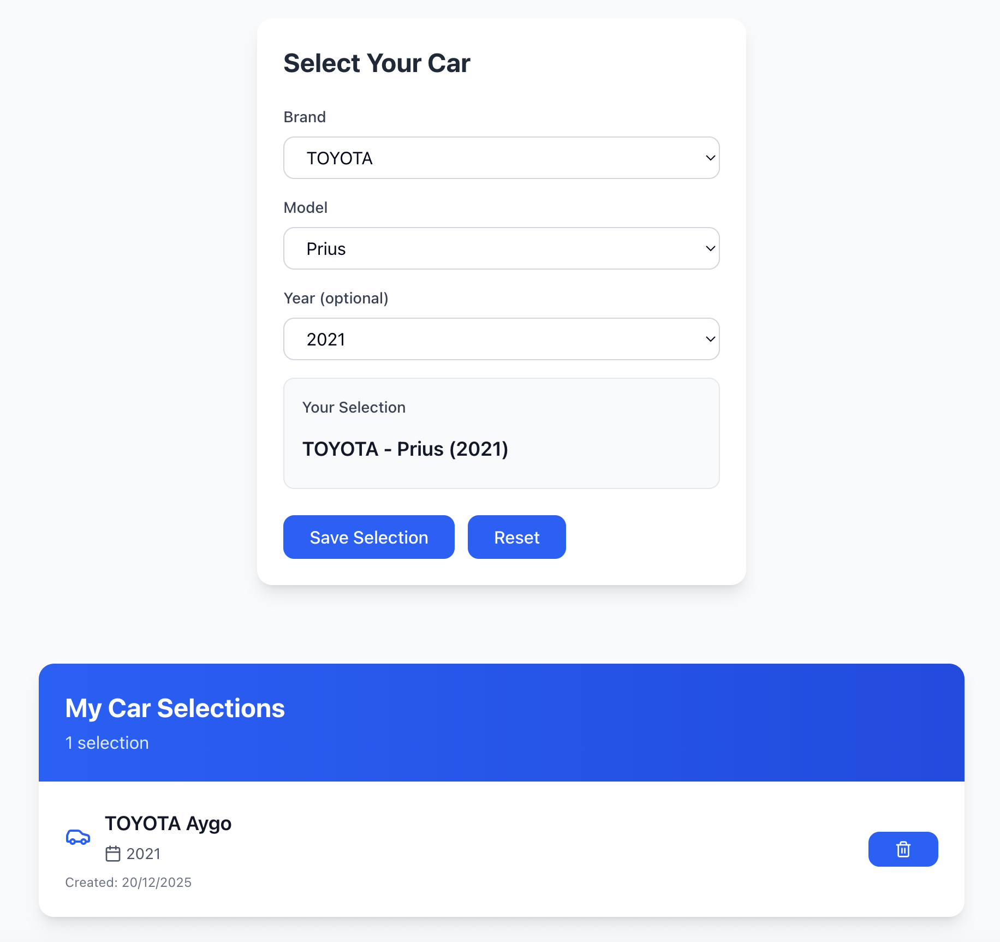

# 🚗 Car Selection App

Application web permettant de sélectionner des véhicules (marque, modèle, année) avec gestion complète via API REST.



---

## ⚙️ Stack technique

### **Core**

- **Framework** : [Next.js 15.1.3](https://nextjs.org/) (App Router, React Server Components)
- **Runtime** : Node.js 20+
- **TypeScript** : 5.7+ (strict mode)

### **Backend**

- **API** : [Hono 4.6.15](https://hono.dev/) (routing, validation)
- **Base de données** : [PostgreSQL 16](https://www.postgresql.org/) (Docker local)
- **ORM** : [Drizzle ORM 0.36.4](https://orm.drizzle.team/)
- **Validation** : [Zod 3.24.1](https://zod.dev/) + [@hono/zod-validator](https://hono.dev/docs/guides/validation)

### **Frontend**

- **UI** : [Tailwind CSS 3.4.17](https://tailwindcss.com/)
- **Components** : Custom components (buttons, alerts, modals)
- **State** : React hooks (useState, useEffect, useContext)

### **DevOps**

- **Database** : Docker Compose (PostgreSQL)
- **Migrations** : Drizzle Kit

---

## 📁 Architecture du projet

```bash
├── app/
│   ├── api/
│   │   └── [[...route]]/
│   │       └── route.ts        # Point d'entrée API Hono (catch-all)
│   ├── selections/
│   │   └── page.tsx            # Page des sélections
│   ├── layout.tsx
│   └── page.tsx                # Page d'accueil
│
├── components/
│   ├── ui/                     # Composants réutilisables
│   │   ├── button.tsx
│   │   ├── alert.tsx
│   │   ├── modal.tsx
│   │   └── spinner.tsx
│   ├── CarSelector.tsx         # Formulaire principal
│   └── SelectionList.tsx       # Liste paginée
│
├── lib/
│   ├── api/
│   │   ├── app.ts              # Configuration Hono
│   │   ├── routes/             # Routes API
│   │   │   ├── brands.ts       # GET /api/brands
│   │   │   ├── models.ts       # GET /api/models
│   │   │   └── selections.ts   # CRUD /api/selections
│   │   └── errors.ts           # Gestion erreurs API
│   ├── db/
│   │   ├── index.ts            # Client Drizzle
│   │   ├── schema.ts           # Définition des tables
│   │   ├── seed.ts             # Données de test
│   │   └── queries/            # Fonctions DB (CRUD)
│   │       ├── brands.ts
│   │       ├── models.ts
│   │       └── selections.ts
│   ├── validations/
│   │   └── selection.ts        # Schémas Zod
│   └── utils/                  # Helpers (pagination etc)    
│
├── hooks/
│   ├── useSelections.ts        # Hook pour les sélections
│   ├── useBrands.ts            # Hook pour les marques
│   └── useModels.ts            # Hook pour les modèles
│
├── context/
│   └── SelectionsContext.tsx   # Context React pour state global
│
├── drizzle/
│   ├── migrations/             # SQL migrations générées
│   └── meta/                   # Métadonnées Drizzle
│
├── docker-compose.yml          # PostgreSQL Docker setup
├── drizzle.config.ts           # Config Drizzle + migrations
├── .env.local                  # Variables d'environnement
└── package.json
```

---

## 🚀 Démarrage rapide

### **1. Prérequis**

```bash
node --version  # v20.0.0 ou supérieur
npm --version  # v10.0.0 ou supérieur
docker --version # v24.0.0 ou supérieur
```

### **2. Installation**

#### Cloner le projet

```bash
git clone https://github.com/guillaume-lecomte/car-selector-app
cd car-selector-app
````

#### Installer les dépendances

```bash
npm install
````

### **3. Configuration de l'environnement**

Créer un fichier .env à la racine à partir de .local.env

### **4. Lancement**

#### Démarrer PostgreSQL

```bash
docker-compose up -d
```

#### Vérifier le conteneur

```bash
docker-compose ps
````

#### Appliquer les migrations

```bash
npm run db:push
````

#### Seed la base

```bash
npm run db:seed
````

#### Lancer l'app

```bash
npm run dev
```

Ouvrir http://localhost:3000

## Optimisations clés à prévoir

### 🚀 **Frontend (Next.js/React)**

- **SSR/Streaming** : `loading.js` + Suspense pour un rendu progressif
- **Cache** : React Query (staleTime/cacheTime optimisés) + prefetching
- **Perf** : `useDeferredValue` pour les listes, `next/image` (WebP + sizes)

### 🗃️ **Backend (API/BDD)**

- **Cache** : Redis (cache aside + invalidation Pub/Sub) pour les données fréquentes
- **API** : Compression (gzip/brotli) + rate limiting (ex: 100 req/min/IP)
- **Patterns*** : Mise en place d'un repository pattern pour découpler les queries de l'accès à la DB
- **Résilience** : Ajout d'une retry logic

### 🧪 **Tests (Pyramide + AAA)**

- **Unit** : Jest (logique pure)
- **Intégration** : MSW (API mockée)
- **E2E** : Cypress (flux critiques)
- **Perf** : k6 (charge) + Lighthouse CI (Web Vitals)

### 🔒 **Sécurité**

- JWT court-lived + refresh tokens
- CSP strict + cookies `SameSite=Strict`
- Chiffrement des données sensibles (pgcrypto)

### 🏗️ **DevOps**

- Feature flags (LaunchDarkly) pour les déploiements progressifs
- Observabilité : Logs (Pino) + Metrics (Prometheus)
- Canary deployments (10% du trafic avant full rollout)
